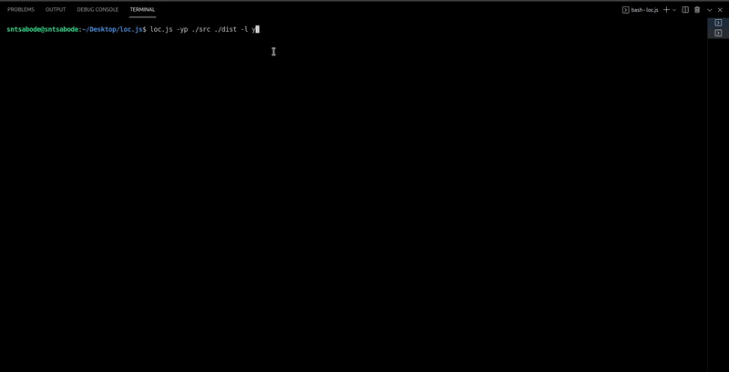

<h1 align="center">loc.js 📝</h1>
<p>
  <a href="#" target="_blank">
    
  </a>
  <a href="https://badge.fury.io/js/@snts.abode%2Floc.js">
    
  </a>
  
  <a href="#" target="_blank">
    
  </a>
  <a href="https://github.com/sntsabode/loc.js/actions/workflows/test.yaml" target="_blank">
    
  </a>
</p>

***loc.js*** is a simple, no dependencies command line tool that counts the number of lines in a project.



## Prerequisites

***Use other verions at own risk***

* node >= 12.x.x

## Installation

### Install from ***npm***

```sh
npm i -g @snts.abode/loc.js
```

Might have to use sudo on ***unix systems***

```sh
sudo npm i -g @snts.abode/loc.js
```

### Install from source

```sh
cd loc.js

yarn i
```

If the above command doesn't work due to admin privileges ***(unix system)***, try

```sh
cd loc.js

yarn i:sudo
```

## Usage

```sh
cd my-project

loc.js <options>
```

### Options:

* `-y` or `--yes` - (`boolean`): Don't ask any questions.

* `-p` or `--paths` - (`string[]`): Enter paths ***loc*** should work in, relative to the cwd.

* `-l` or `--log` - (`y`|`n`): Whether or not the process should log.

## Author

👤 **Sihle Masebuku <snts.abode@gmail.com>**

## Show your support

Give a ⭐️ if this project helped you!
